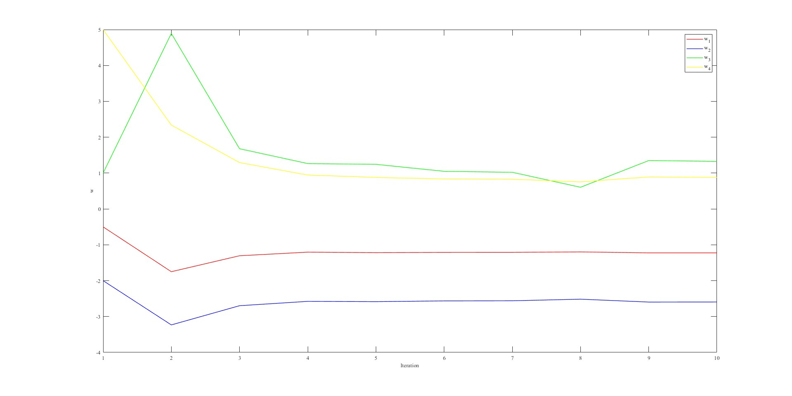

# Introduction
Adaptive Dynamic Programming - ADP

## References
[1] N. D. Phuoc, Toi uu hoa trong dieu khien va dieu khien toi uu. Nha xuat ban Bach Khoa Ha Noi 2017

[2] R. S. Sutton, A. G. Barto, et al., Introduction to reinfocement learning, vol. 135. MIT press Cambridge, 1998.

[3] Y. Jiang and Z.-P. Jiang, Robust adaptive dynamic programming. New York University: John Wiley & Sons, 2017.

[4] K. G. Vamvoudakis and F. L. Lewis, Online actor critic algorithm to solve the continuous-time infinite horizon optimal control problem, Au
tomatica, vol. 46, no. 5, pp. 878888, 2010.

[5] Z. P. J. Y.Jiang, Robust adaptive dynamic programming for large scale systems with an application to multimachine power systems, IEEE
 Transactions on Circuits and Systems, 2012.

# Results

